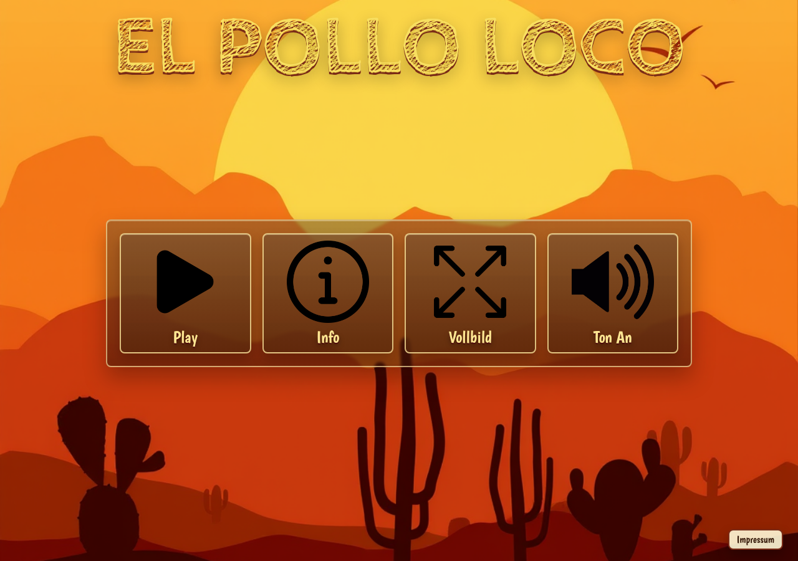
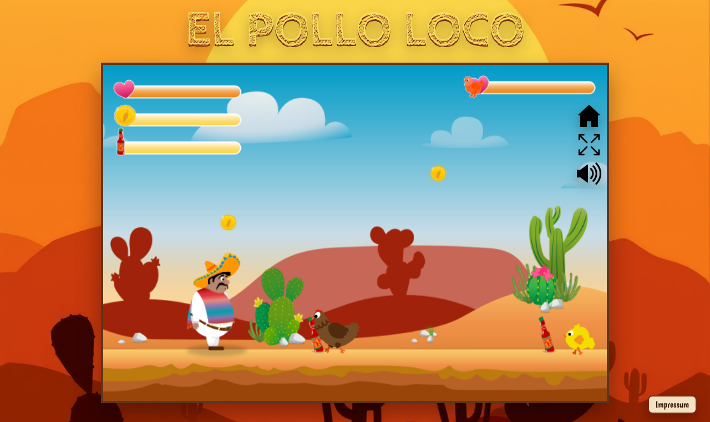

# El Pollo Loco

Ein kleines Jump-and-Run-Spiel im Stil eines Wuesten-Abenteuers. Du steuerst Pepe durch die Landschaft, sammelst Coins und Salsa-Flaschen, weichst Huehnern aus oder besiegst sie von oben und trittst am Ende gegen den Endboss an.

## Screenshots





## Features

- Spielbare Canvas-Welt mit seitlichem Scrolling
- Tastatur- und Touch-Steuerung
- Sammelbare Coins und Salsa-Flaschen
- Wurfmechanik mit animierten Flaschen
- Gegner, Endboss, Statusleisten und Sounds
- Start-, Hilfe-, Vollbild-, Mute-, Win- und Game-over-Screens

## Steuerung

- `A` oder `Pfeil links`: nach links laufen
- `D` oder `Pfeil rechts`: nach rechts laufen
- `W`, `Pfeil hoch` oder `Leertaste`: springen
- `F`: Salsa-Flasche werfen

## Projektaufbau

- [index.html](index.html): Einstiegspunkt und Spieloberflaeche
- [style.css](style.css) und [responsive.css](responsive.css): Layout, Screens und mobile Ansicht
- [js/game.js](js/game.js): Start, Restart, Menues, Sound- und Endscreen-Handling
- [js/classes](js/classes): Spielfiguren, Gegner, Objekte, Kollisionen und Statusleisten
- [js/levels/level1.js](js/levels/level1.js): Aufbau des Levels mit Hintergruenden, Gegnern und Sammelobjekten
- [img](img) und [audio](audio): Grafiken und Sounds

## Lokal starten

Das Projekt braucht keinen Build-Schritt. Oeffne [index.html](index.html) direkt im Browser oder starte einen kleinen lokalen Server:

```bash
python3 -m http.server 8000
```

Danach ist das Spiel unter `http://localhost:8000` erreichbar.
